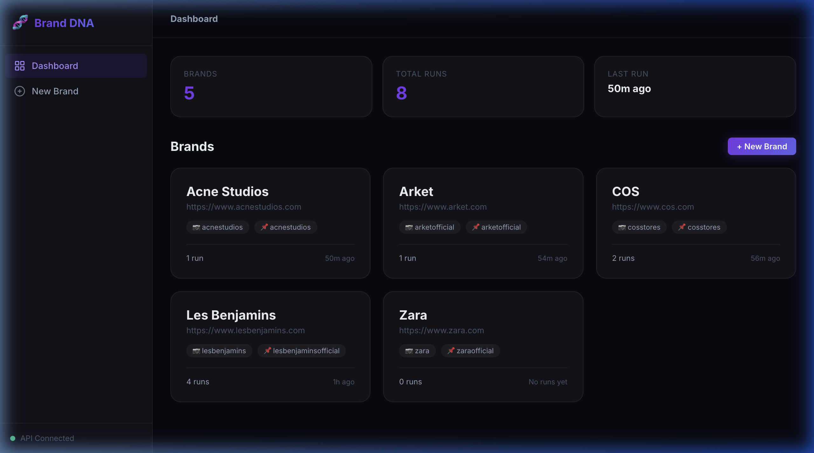
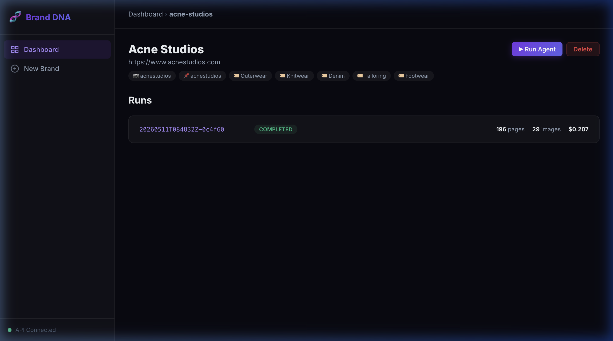
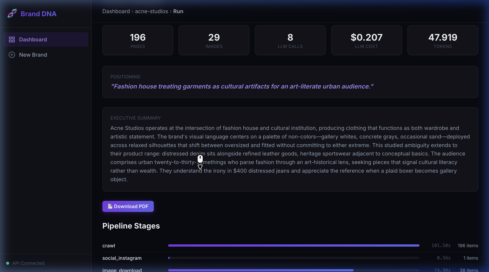
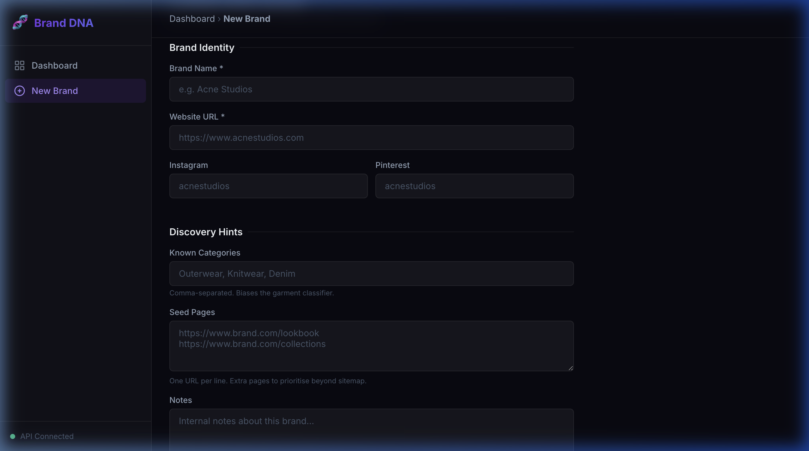

# 🧬 Brand DNA Agent

**Autonomous Brand Intelligence for the Fashion Industry.**

Brand DNA Agent is a high-performance AI agent that crawls fashion brand websites and social presence to extract structured "Brand DNA" dossiers. It combines advanced computer vision (FashionCLIP), aesthetic clustering, and multimodal LLMs to produce strategic insights in PDF and JSON formats.



## 🚀 Technical Innovation

This agent isn't just a crawler; it's a multi-stage intelligence pipeline designed for high-fidelity brand synthesis.

- **🌍 Cross-Lingual Strategic Analysis:** Automatically detects and analyzes brand identity in its native language (French, Italian, Turkish, etc.) while synthesizing insights in professional English. Perfect for global fashion houses.
- **🎨 Generative DNA Prompts:** Translates extracted brand DNA into production-ready prompts for **Stable Diffusion XL** and **Midjourney**, enabling instant creative exploration aligned with the brand's aesthetic.
- **🤖 AI Self-Evaluation (QA Layer):** Implements a secondary LLM "critic" stage that audits the final dossier for consistency, hallucination risk, and logical alignment, assigning a verifiable Confidence Score.
- **⚡ Parallel Intelligence Pipeline:** Uses asynchronous orchestration to run visual and textual analyses concurrently, optimizing runtime for enterprise-scale discovery.
- **🛡️ Robust Acquisition Engine:** Advanced bot-detection bypass with browser-like header rotation, session persistence, and optional Playwright JS-rendering for SPA-heavy retail sites (Zara, COS, etc.).

## 🛠️ Architecture & Stack

- **Reasoning:** Claude 3.5 Sonnet (Synthesis) & Gemini 1.5 Pro (Long-context analysis).
- **Vision:** CLIP-based aesthetic clustering & multi-modal LLM reasoning.
- **Core:** Python 3.11+, Pydantic V2 (Data Contract), FastAPI.
- **Storage:** SQLite-backed Metadata Store for portable, inspectable runs.
    - 🤖 **Machine Manifests:** Refabric-compatible training modules (Look, Mood, Pattern, etc.).
- **Modern Web Dashboard:** A sleek, responsive dark-mode UI to manage brands and monitor runs in real-time.

## 🖼 Interface Preview

| Brand Management | Analysis Report |
|------------------|-----------------|
|  |  |

> *Adding a new brand is as simple as entering a URL:*
> 

## 📄 Example Outputs

You can find complete examples of the agent's output in the [examples/](./examples) directory:
- [PDF Brand DNA Dossier (Acne Studios)](./examples/acne-studios-dna.pdf)
- [JSON Brand DNA Data](./examples/acne-studios-dna.json)
- [Refabric Training Manifest](./examples/acne-studios-train.json)

## 🛠 Tech Stack

- **Core:** Python 3.11+, Pydantic V2, asyncio
- **Vision/ML:** FashionCLIP, scikit-learn, NumPy
- **LLM Layer:** OpenRouter (Claude 3.5 Sonnet, Gemini 1.5 Pro)
- **Web/API:** FastAPI, Uvicorn, Vanilla JS/CSS (SPA)
- **PDF Engine:** WeasyPrint + Jinja2

## 📦 Installation

```bash
# Clone the repository
git clone https://github.com/yldrmabdullah/brand-dna-agent.git
cd brand-dna-agent

# Create virtual environment
python -m venv venv
source venv/bin/activate

# Install dependencies
make install-dev
make install-web
```

## 🚦 Quick Start

1. Create a `.env` file with your `OPENROUTER_API_KEY`.
2. Start the web dashboard:
   ```bash
   make serve
   ```
3. Open `http://localhost:8000`, add a brand URL, and click **Run Agent**.

---

## 🏗 Architecture

The agent operates in a 15-stage asynchronous pipeline, managed by a central Orchestrator. It is designed with **graceful degradation**—if one stage fails (e.g., Instagram blocks access), the agent still produces the best possible dossier using remaining signals.

---
*Developed for strategic fashion analysis and AI training preparation.*
